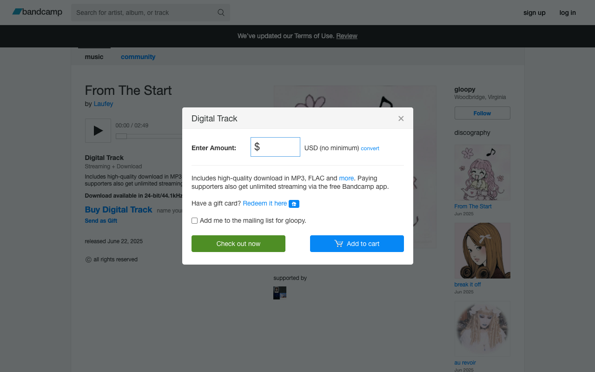

# Coding Agents: Increase the autonomy slider

*July 2025*

**TL;DR**: Make Claude verify its own work. Scripts, logs, screenshots. Stop being the QA. I now run 5 Claude instances in parallel instead of babysitting one.

*If you want to see code, see [this project](https://gitingest.com/databricks-solutions/agent-monitoring-demo-app) where I built a Databricks App that has a UI with a LangGraph Agent, monitored with MLflow 3.0. This post will focus on Claude Code, but these tricks apply to Cursor, Gemini, and other AI coding tools.*

In his [Software 3.0 talk](https://www.youtube.com/watch?v=LCEmiRjPEtQ), Karpathy describes what he calls the "autonomy slider." You can be "mostly in charge" with small edits, or slide toward full autonomous operations. This post is about turning that slider up enough that I can actually go make coffee while Claude builds features.

My approach: figure out where I'm the bottleneck and automate it away. Every time I find myself checking Claude's work, I ask "how can Claude check this instead?" This post shares what I've learned—the good, the bad, and the times Claude deleted my entire database (kidding, but only because I had safeguards).

**The Naive Way (Human as Bottleneck):**


**The Self-Verification Way:**


Let me run with Karpathy's orchestra metaphor. I'm conducting an orchestra where every musician has a 10-minute memory—brilliant players who forget what symphony we're playing between movements. As conductor, I'm constantly reminding them what piece we're playing, what key we're in, where we're headed.

I used to write down every single note. Now? I teach them to hear when they're out of tune.

Good engineering practices—tests, types, docs—these are the sheet music for my forgetful musicians. A README isn't documentation; it's a memory aid. Types aren't just for catching bugs; they're guardrails that stop Claude from passing a User object to a function expecting a banana.

This post is about ear training. Teaching my musicians to know when they're in key, when they're following the progression, and when they're veering into jazz fusion during a Bach concerto.

## Tuning Instruments: Choosing the Right Stack

Before teaching musicians to play, you need the right instruments. Three things matter when choosing tools for AI agents: speed, guardrails, and rich type information. Turns out what helps humans—fast feedback, strong types, clear docs—is exactly what Claude needs.

I always use Python type hints and TypeScript. Never plain JavaScript. More type info = less chance Claude does something completely insane.

The stack I use for simple Python backend + TypeScript frontend projects:

### Python tooling

- [uv](https://github.com/astral-sh/uv), for 10-100x faster package management
- [Ruff](https://github.com/astral-sh/ruff), for lightning-fast linting and formatting
- [ty](https://github.com/astral-sh/ty), for extremely fast type checking

*(I just use whatever [Charlie Marsh](https://twitter.com/charliermarsh) builds at this point.)*

### Backend framework
[FastAPI](https://fastapi.tiangolo.com/). The automatic OpenAPI docs at `/docs` are clutch—Claude can read them to understand your API without me copy-pasting endpoint definitions.

### Frontend

- [Vite](https://vitejs.dev/), for lightning-fast dev server with hot module replacement
- [Bun](https://bun.sh/), for all-in-one JavaScript tooling
- [React](https://react.dev/), for component-based UIs agents understand
- [shadcn/ui](https://ui.shadcn.com/), for copy-paste components with full code ownership

### Python ⟷ Frontend bridge
OpenAPI code generation. FastAPI schemas → OpenAPI spec → TypeScript types and client code. Change a Python type? TypeScript updates automatically. No more "oh I forgot to update the frontend types" bugs.

Here's the thing: all these tools create tight feedback loops. Claude writes code, the tooling immediately screams if something's wrong, Claude fixes it. No waiting for me to notice.

## Ear Training: Self-Verification

Every time I build something now, I ask myself two questions:

1. **What am I building?**
2. **How will Claude know if it worked?**

It's easier for LLMs to verify than to generate. Just like how anyone can hear when a note is off-key, but playing in tune is hard. So I teach Claude to be its own critic.

Here are the techniques I use. You don't need all of them—pick what makes sense for your setup.

### Basic Self-Verification

The basics. Nothing fancy, but these save me from being Claude's babysitter.

#### Scripts

Create simple scripts for everything. Here's what I typically have:

**watch.sh** - The most important script. Every time Claude changes code, the server restarts. If something breaks, it shows up in the logs immediately. Claude reads the error, fixes it, tries again. No waiting for me to say "hey, you broke the imports":
```bash
#!/bin/bash
# Kill existing processes first
pkill -f uvicorn 2>/dev/null
pkill -f vite 2>/dev/null

# Start everything in parallel
uv run uvicorn server.main:app --reload &
bun vite --host &

# Auto-regenerate TypeScript client when Python changes
uv run watchmedo shell-command \
  --patterns="*.py" \
  --command='uv run python make_openapi.py | npx openapi-typescript-codegen --input stdin --output client/api' \
  src/server &
```

In CLAUDE.md, I tell it to run with: `nohup ./watch.sh > watch.log 2>&1 &`

Everything hot reloads. Python changes trigger TypeScript regeneration. If something hangs, Claude can read the logs and restart with `pkill`.

**fix.sh** - Auto-fixes what it can. Claude runs this, then fixes whatever's left:
```bash
uv run ruff check . --fix
bun run prettier --write .
```

#### Print Statements

Old school but effective. When something's slow or acting weird, I tell Claude: "add timing logs to every function in this flow." Claude instruments the code, we find the bottleneck, fix it, remove the logs. 

No fancy profilers. Just:
```python
start = time.time()
# ... code ...
print(f"Processing took {time.time() - start:.2f}s")
```

Sometimes the oldest debugging techniques work best.

#### Claude Scratchpad

I give Claude a `claude_scripts/` folder (gitignored) for throwaway scripts. Something acting weird? Claude writes a script to figure it out. No more "let me add some print statements and see what happens":
```python
# /// script
# requires-python = ">=3.11"
# dependencies = ["requests", "pandas"]
# ///

import requests
import pandas as pd

# Quick analysis script Claude wrote
response = requests.get("http://localhost:8000/metrics")
df = pd.DataFrame(response.json())
print(df.describe())
```
Without this folder, Claude leaves test scripts everywhere like a messy roommate. UV's inline dependencies mean no virtual env setup—just run the script.

#### API Self-Testing

FastAPI gives you `/docs` for free. I tell Claude to read them and figure out the API itself:
```markdown
## API Endpoints
- API docs: http://localhost:8000/docs
- OpenAPI spec: `curl http://localhost:8000/openapi.json`

## Common endpoints
- Health check: `curl http://localhost:8000/health`
- Create item: `curl -X POST http://localhost:8000/items -d '{"name": "test"}'`
- List items: `curl http://localhost:8000/items`
```
Now Claude can test its own endpoints. No more "I think this works" moments.

#### Browser Automation with Playwright

Claude can take screenshots and see what it built. Install the MCP:
```bash
claude mcp add playwright npx '@playwright/mcp@latest'
```
Now Claude can click buttons, take screenshots, verify the UI actually works. Way better than me describing what's broken.

*(If you want to automatically login with Playwright, I made [this repo](https://github.com/nsthorat/claude-playwright-cookie-copy) which will automatically copy cookies before opening Playwright.)*

#### Deployment

In my Databricks app, I just say "deploy." Claude runs the script, watches the logs, fixes any startup issues. If pip complains about dependencies? Claude fixes it. Port already in use? Claude handles it.

## Crescendo: The Next Movement

Once you have the basics down, here's where it gets interesting. These are some examples I thought were cool when in the self-verification loop mindset:

### Automated Purchasing of Bandcamp Songs

I wanted to buy songs from Bandcamp automatically.

What makes this interesting: Claude slowly builds itself a deterministic scraper. It uses LLMs to figure out each step, but the final script has zero AI—just pure automation that works every time.

*(This is part of another project I'm working on that I'll release at some point!)*

Here's what worked:

- Told Claude to build the automation step by step
- At each page, dump the DOM and take a screenshot
- Success = download link appears after purchase
- "Show me what you see, I'll tell you what to click"

Claude built it incrementally:

**Iteration 1:**
```python
# Just navigate and see what's there
await page.goto("https://gloopy1.bandcamp.com/track/from-the-start")
await page.screenshot(path="debug_1_initial.png")
with open("debug_1_initial.html", "w") as f:
    f.write(await page.content())
```


Claude sees the page, finds the "Buy Digital Track" button. I confirm, we move on.

**Iteration 2:**
```python
# Navigate and click the buy button
await page.goto("https://gloopy1.bandcamp.com/track/from-the-start")
await page.screenshot(path="debug_1_initial.png")

await page.click("button:has-text('Buy Digital Track')")
await page.screenshot(path="debug_2_after_click.png")
with open("debug_2_after_click.html", "w") as f:
    f.write(await page.content())
```



Price input appears. Claude knows what to do next.

**Iteration 3:**
```python
# Navigate, click buy, fill price, add to cart
await page.goto("https://gloopy1.bandcamp.com/track/from-the-start")
await page.click("button:has-text('Buy Digital Track')")
await page.fill("#userPrice", "2.00")
await page.click("button:has-text('Add to cart')")
await page.screenshot(path="debug_3_after_cart.png")
with open("debug_3_after_cart.html", "w") as f:
    f.write(await page.content())
```


Item's in the cart. Claude keeps building toward checkout.

This goes on—checkout, PayPal auth, purchase confirmation—until Claude sees the download link. Success.

The final script runs without any AI. Just pure automation, built by showing Claude what to click at each step.

### Self-Improving Synthetic Data Pipeline

I wanted to synthesize data to test our product. The twist: I need to evaluate the evaluator. Are my fake users realistic? Diverse? Actually testing the right things?

My self-verification pipeline:

1. **Generate conversations**: Claude runs a script that creates 20 synthetic user-agent conversations
2. **Evaluate quality**: Claude writes another script that programmatically evaluates these conversations against defined criteria (stored in MLflow/Databricks)
3. **Generate reports**: Produces markdown reports with quality metrics and progress tracking

Claude reads these reports, plans improvements, implements changes, evaluates again. Each iteration gets better:

---

<details>
<summary>📊 Initial Report - June 30, 22:48 (Realism: 0%, Coverage: 0%, Tool diversity: 0)</summary>

<h4>Example Synthetic Data Analysis Report (Initial)</h4>

<p>Generated: 2025-06-30T22:48:16.485474 Traces Analyzed: 10</p>

<h5>Executive Summary</h5>

<p>
⚠️ <strong>Good diversity</strong> - All 10 synthetic conversations were unique<br>
⚠️ <strong>Zero errors</strong> - Quality checks passed 100%<br>
❌ <strong>Conversations unrealistic</strong> - Users ask questions like robots
</p>

<p>The pipeline works but needs improvement. Conversations are diverse but don't feel human yet.</p>

<h5>Initial Assessment</h5>

<p><strong>✅ What's working:</strong></p>
<ul>
<li><strong>Diversity</strong> at 100%</li>
<li><strong>Quality</strong> at 100%</li>
</ul>

<p><strong>🔴 Major issues:</strong></p>
<ul>
<li><strong>Conversations feel robotic</strong> (Realism: 0%)</li>
<li><strong>Limited feature coverage</strong> (Coverage: 0%)</li>
<li><strong>No tool usage</strong> (Tool diversity: 0)</li>
<li><strong>Conversation endings</strong> abrupt (0%)</li>
</ul>

<h5>Score Summary</h5>

<table>
<tr><th>Metric</th><th>Score</th></tr>
<tr><td>Diversity Score</td><td>1.00</td></tr>
<tr><td>Quality Score</td><td>1.00</td></tr>
<tr><td>Realism Score</td><td>0.00</td></tr>
<tr><td>Ending Realism Score</td><td>0.00</td></tr>
<tr><td>Coverage Score</td><td>0.00</td></tr>
</table>

</details>

---

**🔄 Iterate**

After seeing this report, I ask Claude to come up with a plan to fix the issues. Claude analyzes the metrics and proposes specific changes—maybe adding natural language patterns, expanding test scenarios, or introducing tool usage. We implement the plan, check the changes into GitHub, run the pipeline again, and generate a new report:

---

<details open>
<summary>📊 Improved Report - June 30, 22:55 (Realism: 100% ✅, Coverage: 67% ⬆️, Tool diversity: 19 ⬆️)</summary>

<h4>Example Synthetic Data Analysis Report</h4>

<p>Generated: 2025-06-30T22:55:38.621661 Traces Analyzed: 14</p>

<h5>Executive Summary</h5>

<p>
✨ <strong>Perfect diversity</strong> - All 14 synthetic conversations were completely unique<br>
✨ <strong>Zero errors</strong> - Quality checks passed 100%<br>
✨ <strong>No repetition</strong> - Each synthetic user asked different questions
</p>

<p>The pipeline is working! It's generating realistic, diverse conversations that actually test different aspects of the agent.</p>

<h5>Comparison with Previous Report</h5>

<p>Comparing with report from 2025-06-30T22:48:16.485474</p>

<p><strong>✅ What got better:</strong></p>
<ul>
<li><strong>Conversations feel real now</strong> (Realism: 0→100%)</li>
<li><strong>Better feature coverage</strong> (Coverage: 0→67%)</li>
<li><strong>Using more tools</strong> (Tool diversity: 0→19)</li>
</ul>

<p><strong>🔷 Still perfect:</strong></p>
<ul>
<li><strong>Diversity</strong> stays at 100%</li>
<li><strong>Quality</strong> stays at 100%</li>
</ul>

<p><strong>🔴 Still needs work:</strong></p>
<ul>
<li><strong>Conversation endings</strong> still abrupt (0%)</li>
</ul>

<h5>Score Changes Summary</h5>

<table>
<tr><th>Metric</th><th>Previous</th><th>Current</th><th>Change</th><th>% Change</th></tr>
<tr><td>Diversity Score</td><td>1.00</td><td>1.00</td><td>0.00</td><td>0.0%</td></tr>
<tr><td>Quality Score</td><td>1.00</td><td>1.00</td><td>0.00</td><td>0.0%</td></tr>
<tr><td>Realism Score</td><td>0.00</td><td>1.00</td><td>+1.00</td><td>+0.0%</td></tr>
<tr><td>Ending Realism Score</td><td>0.00</td><td>0.00</td><td>0.00</td><td>0.0%</td></tr>
<tr><td>Coverage Score</td><td>0.00</td><td>0.67</td><td>+0.67</td><td>+0.0%</td></tr>
</table>

</details>

---

## Conclusion

These are just some ideas for creating verification loops. Look for them everywhere. Every manual check is a candidate for automation.

This shift is exciting. Instead of fighting with code, debugging syntax errors, or tracking down missing semicolons, I get to think about the product. The user experience. The architecture. I'm not a typist anymore—I'm back to being a conductor.

What used to be one Claude instance needing constant supervision is now five Claudes building different features in parallel. Same amount of my time, 5x the output.

The best part? Everything that helps AI helps us too. Clear docs, strong types, good tests—these were already best practices. Now they're essential.

My musicians can finally hear when they're off-key. And me? I can focus on composing the symphony instead of correcting every note.
