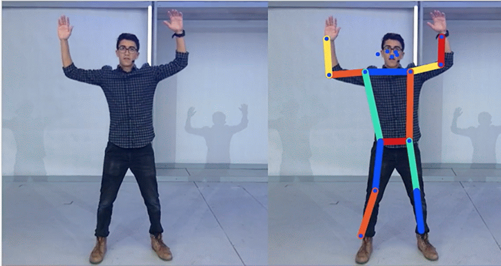

---
hide:
  - toc
  - title
---

# nikhil thorat

  

  

    I write software, tinker with music, build aquariums, live in a church, and try not to take myself too seriously.
  

  

    Most recently, I co-founded <a href="https://www.lilacml.com/">Lilac AI</a>, which is now <a href="https://www.databricks.com/blog/lilac-joins-databricks-simplify-unstructured-data-evaluation-generative-ai">joining Databricks</a>.
  

  

    Before that, I was at Google for 10+ years where I created projects like <a href="https://www.tensorflow.org/js">TensorFlow.js</a> and <a href="https://knowyourdata.withgoogle.com/">Know Your Data</a>.
  

  

  

## [work](work/index.md)
- [Lilac AI](https://www.lilacml.com/)
- [TensorFlow.js](https://www.tensorflow.org/js)
- [Know Your Data](https://knowyourdata.withgoogle.com/)

## [blog](blog/index.md)
- [Lessons of a first time founder](./blog/lessons-of-a-first-time-founder.md)

## [music](music/index.md)
- [songs](./music/index.md#bringmeanimals)
- [ableton plugins](./music/index.md#ableton-plugins)

