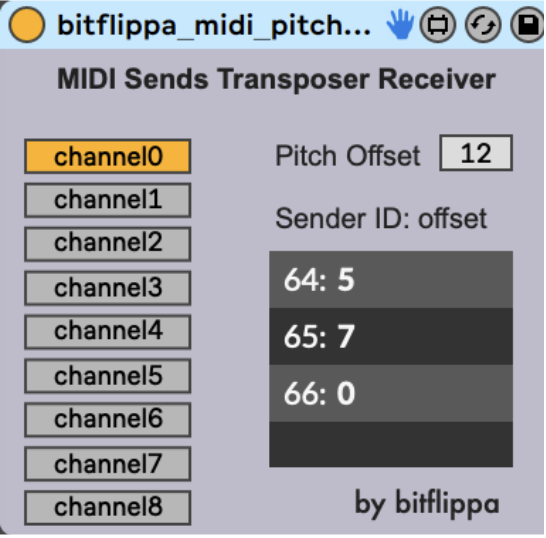

# music

## [bringmeanimals](https://open.spotify.com/artist/045SkIc8zYtemYvlf5TH7r)

<iframe style="border-radius:12px" src="https://open.spotify.com/embed/track/0bARtWFMFAXPUUwBHpDvWA?utm_source=generator&theme=0" width="100%" height="152" frameBorder="0" allowfullscreen="" allow="autoplay; clipboard-write; encrypted-media; fullscreen; picture-in-picture" loading="lazy"></iframe>
 
<iframe style="border-radius:12px" src="https://open.spotify.com/embed/track/2ghDEH7ZmuHTgo1jWF4GZt?utm_source=generator&theme=0" width="100%" height="152" frameBorder="0" allowfullscreen="" allow="autoplay; clipboard-write; encrypted-media; fullscreen; picture-in-picture" loading="lazy"></iframe>
 
<iframe width="100%" height="166" scrolling="no" frameborder="no" allow="autoplay" src="https://w.soundcloud.com/player/?url=https%3A//api.soundcloud.com/tracks/1678921734&color=%23745c4c&auto_play=false&hide_related=true&show_comments=false&show_user=true&show_reposts=false&show_teaser=false"></iframe>
<a href="https://soundcloud.com/bringmeanimals" title="bringmeanimals" target="_blank" style="color: #cccccc; text-decoration: none;">bringmeanimals</a> · <a href="https://soundcloud.com/bringmeanimals/mary-did-you-know" title="mary did you know" target="_blank" style="color: #cccccc; text-decoration: none;">mary did you know</a>

 

## ableton plugins

  

    
  

  

    <a href="https://maxforlive.com/library/device/8163/modulator-thresholding-midi-trigger">Modulator Thresholding MIDI Trigger 1.0</a>
    
This device sets up a parameter to be modulated with an LFO, envelope follower, or just a regular automation, and allows users to define a threshold, which when crossed, a MIDI note is fired.

  

 

  
  

    <a href="https://docs.google.com/document/d/1r--PgJlW1dQQuigYCJFDV4tpa2tBmQW4g-cAL4tn3C0/edit">MIDI Sends Pitch Transposer</a>
    
This plugin transposes a polyphonic MIDI track by a monophonic MIDI transposer track.

  

