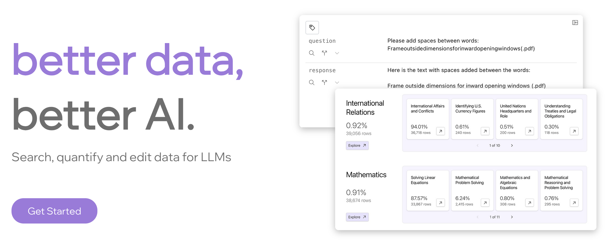
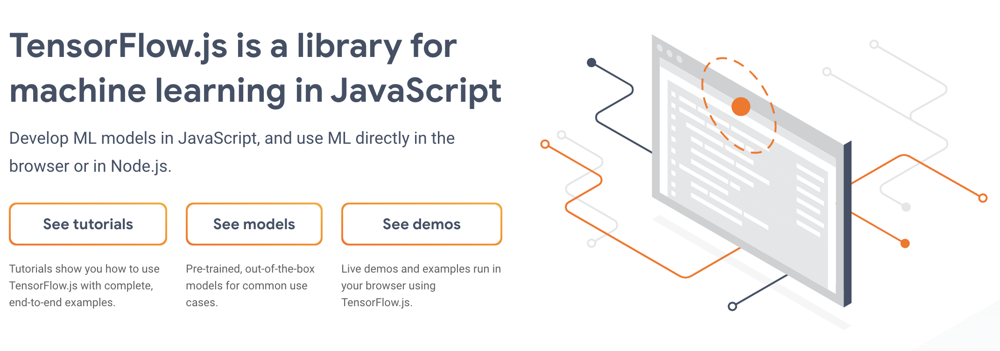

# work

## [Lilac](https://www.lilacml.com/)
I co-founded Lilac in 2023 with the mission of improving datasets for AI. We recently got
[acquired by Databricks](https://www.databricks.com/blog/lilac-joins-databricks-simplify-unstructured-data-evaluation-generative-ai).

## [TensorFlow.js](https://www.tensorflow.org/js)

I co-created TensorFlow.js, a WebGL-accelerated library for machine learning in JavaScript.

## [Know Your Data](https://knowyourdata.withgoogle.com/)

I co-created Know Your Data, a tool for understand datasets for Machine Learning.

